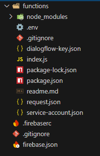

# Generador de Rutinas de Ejercicio

Esta es una aplicación en Node.js que usa Firebase Firestore y Google Dialogflow para crear rutinas de ejercicio personalizadas según lo que el usuario pida. Funciona como un servidor que responde a mensajes y genera rutinas de entrenamiento.

## ¿Qué hace?

- **Entiende mensajes**: Usa Dialogflow para saber qué quiere el usuario (por ejemplo, rutinas de "pecho", "piernas" o para principiantes).
- **Guarda ejercicios**: Usa Firestore para almacenar y buscar ejercicios por tipo o grupo muscular.
- **Crea rutinas**: Genera rutinas con ejercicios aleatorios.
- **Webhook**: Responde a mensajes enviados desde Dialogflow.

## Requisitos

- **Node.js**: Versión 14 o superior.
- **Cuenta de Firebase**: Proyecto en Firestore ("tener una coleccion llamada exercises y por como esta hecho los primaryMuscles deben ser referencias a los musculos que tenemos en otra coleccion llamada muscles") y una clave de servicio (`service-account.json`).
- **Cuenta de Dialogflow**: Un agente configurado con una clave de servicio(`dialogflow-key.json`).
- **Preguntas al agente**: Las cuestiones relacionadas con el proyecto se haran con el archivo request.json o tambien existe la opcion de utilizar curl.
- **Archivo** `.env`: Crea un archivo `.env` con:

  ```
  GOOGLE_APPLICATION_CREDENTIALS=./service-account.json
  DIALOGFLOW_PROJECT_ID=dialogflow-projectid
  DIALOGFLOW_KEY_PATH=./dialogflow-key.json
  ```

## Instalación

1. Clona el proyecto:

   ```
   git clone <url-del-repositorio>
   cd <carpeta-del-proyecto>
   ```

2. Instala las dependencias:

   ```
   npm install
   ```

3. Configura el archivo `.env`:

    - Crea un archivo `.env` en la raíz del proyecto.
    - Añade las variables de entorno (ver **Requisitos**).

4. Coloca la clave de Firebase:

    - Guarda los archivos `service-account.json` y `dialogflow-key.json` en la raíz del proyecto.

5. Llena Firestore:

    - Añade ejercicios a la colección `exercises` en Firestore con campos como `name`, `type`, `primaryMuscle`, etc.

## Cómo usar

1. Inicia el servidor desde la terminal con:

   ```
   npm start
   ```

   Esto lanza la aplicación en `http://localhost:3000` (o el puerto que configures).

   Ver desde tu navegador prefereido.

    2. Usa el webhook:

    - Envía mensajes al endpoint `http://localhost:3000/webhook` con un JSON desde el archivo request.json situado en la raiz del proyecto, ejemplo de mensaje

      ```json
      { "message": "Dame una rutina de piernas" }
      ```

        3. Prueba Firestore:

    - Visita `http://localhost:3000/test-firestore` para ver algunos ejercicios.

## Comandos útiles

- **Iniciar el servidor**:

  ```
  npm start
  ```

    - **Probar el webhook**: Usa `curl` o Invoke-WebRequest:

  ```
  curl -X POST http://localhost:3000/webhook -H "Content-Type: application/json" -d '{"message": "Rutina de pecho"}'
  Invoke-WebRequest -Uri http://localhost:3000/webhook -Method POST -ContentType "application/json" -Body '{"message": "me gustaría una Rutina de push"}'
  Invoke-WebRequest -Uri http://localhost:3000/webhook -Method POST -ContentType "application/json" -Body '{"message": "me gustaría una Rutina de empuje"}'
  Invoke-WebRequest -Uri http://localhost:3000/webhook -Method POST -ContentType "application/json" -Body '{"message": "me gustaría una Rutina de push", "language": "es"}'
  Invoke-WebRequest -Uri http://localhost:3000/webhook -Method POST -ContentType "application/json" -Body '{"message": "I’d like a push routine", "language": "en"}'
  Invoke-WebRequest -Uri http://localhost:3000/webhook -Method POST -ContentType "application/json" -Body '{"message": "me gustaría una Rutina de pull", "language": "es"}'
  Invoke-WebRequest -Uri http://localhost:3000/webhook -Method POST -ContentType "application/json" -Body '{"message": "I’d like a pull routine", "language": "en"}'
  ```

  ## Estructura

- `index.js`: Código principal con la lógica del servidor.
- `service-account.json`: Clave de Firebase (no incluir en git).
- `dialogflow-key.json`: Clave de Dialogflow (no incluir en git).
- `.env`: Configuración de variables.
- `request.json`: Archivo para pruebas del webhook.
- `package.json`: Dependencias y scripts.

## Dependencias

- `express`: Framework para el servidor.
- `firebase-admin`: Conexión con Firestore.
- `@google-cloud/dialogflow`: Procesamiento de mensajes.
- `dotenv`: Carga variables de entorno.

## Notas

- Configura los intents en Dialogflow para que coincidan con los del código (`push`, `pull`, `legs`, etc.).
- Asegúrate de que Firestore tenga datos en la colección `exercises`.
- Para producción, protege el webhook y considera servicios como Heroku.

## Solución de problemas

- **Error en Firebase**: Revisa que `service-account.json` esté correcto.
- **Error en Dialogflow**: Verifica las variables `DIALOGFLOW_PROJECT_ID` y `DIALOGFLOW_KEY_PATH`.
- **Sin ejercicios**: Asegúrate de que la colección `exercises` tenga datos.




